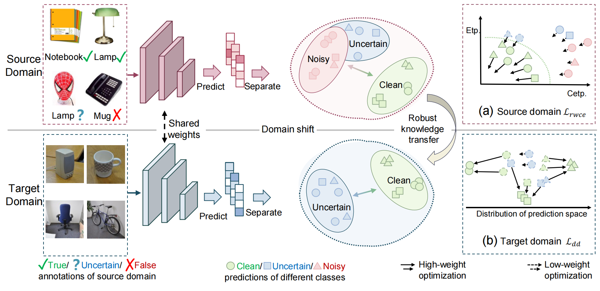

The original implementation version of MM 2023 paper **ROAD: Robust Unsupervised Domain Adaptation with Noisy Labels**. The [Office-31](https://faculty.cc.gatech.edu/~judy/domainadapt/) and [Office-Home](https://www.hemanthdv.org/officeHomeDataset.html) dataset should be put into ./data/ wherever appropriate. *cd pytorch* and *bash road_run.sh* to start the training.

## Abstract
In recent years, Unsupervised Domain Adaptation (UDA) has emerged as a popular technique for transferring knowledge from a labeled source domain to an unlabeled target domain. However, almost all of the existing approaches implicitly assume that the source domain is correctly labeled, which is expensive or even impossible to satisfy in open-world applications due to ubiquitous imperfect annotations (i.e., noisy labels). In this paper, we reveal that noisy labels interfere with learning from the source domain, thus leading to noisy knowledge being transferred from the source domain to the target domain, termed Dual Noisy Information (DNI). To address this issue, we propose a robust unsupervised domain adaptation framework (ROAD), which prevents the network model from overfitting noisy labels to capture accurate discrimination knowledge for domain adaptation. Specifically, a Robust Adaptive Weighted Learning mechanism (RSWL) is proposed to adaptively assign weights to each sample based on its reliability to enforce the model to focus more on reliable samples and less on unreliable samples, thereby mining robust discrimination knowledge against noisy labels in the source domain. In order to prevent noisy knowledge from misleading domain adaptation, we present a Robust Domain-adapted Prediction Learning mechanism (RDPL) to reduce the weighted decision uncertainty of predictions in the target domain, thus ensuring the accurate knowledge of source domain transfer into the target domain, rather than uncertain knowledge from noise impact. Comprehensive experiments are conducted on three widely-used UDA benchmarks to demonstrate the effectiveness and robustness of our ROAD against noisy labels by comparing it with 13 state-of-the-art methods.

## Framework
The pipeline of our Robust Unsupervised Domain Adaptation Framework (ROAD). The data of different domains are fed into the domain-shared network to compute their soft class predictions. Then the Robust Self-adaptive Weighted Learning mechanism (RSWL) and Robust Domain-adapted Prediction Learning mechanism (RDPL) are conducted on the predictions of source and target domains, respectively. Specifically, RSWL employs a self-adaptive weighted scheme upon the mutual information (i.e. cross-entropy) between predictions and labels and self-information (i.e. entropy) of predictions to make the
model focus on reliable samples. Furthermore, RDPL attempts to minimize the weighted decision uncertainty of predictions in the target domain, resulting in the robust transfer of discrimination knowledge against dual noisy information (DNI).

## Requirements
- python 3.7
- pyTorch 1.7
- torchvision 0.8.2
- numpy 1.20.1

## Train and test
Run road_run.sh for Office-31 and Office-Home datasets.